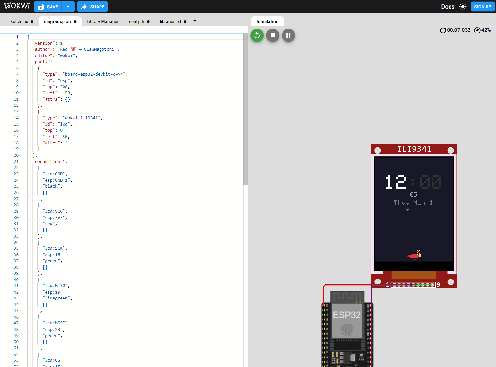

# 🦞 ClawMagotchi

> A physical desk companion powered by ESP32 — an animated lobster that lives on your desk, shows the time, and reacts to live notifications from your AI assistant.


<!--  -->
<!-- TODO: Add photo of the device on Michel's desk once hardware arrives -->

---

## What It Does

ClawMagotchi is a tiny animated creature ("Red") that lives on a 1.47" TFT display on your desk. It shows the time in a retro green 7-segment LCD style, and reacts in real-time to signals from **Clawpilot** — an AI assistant that monitors your email, Teams, calendar, and work patterns.

Red isn't just a clock — it's a context-aware companion with **23 behavioral scenarios**:

| # | Scenario | Message | What Red Does |
|---|----------|---------|---------------|
| 1 | Idle / No News | — | Slow pacing back and forth |
| 2 | Deep Focus | "Focus" | Stands still with shield icon |
| 3 | Context Switching | "Too fast" | Dizzy wobble animation |
| 4 | Task Nudge | "This?" | Pokes forward holding question mark |
| 5 | Long Session | "Break?" | Slouches, clock icon |
| 6 | Meeting Soon | "5 min" | Alert stance, clock icon |
| 7 | Late! | "Late!" | Fast running with warning |
| 8 | Important Email | "Mail!" | Holds envelope in claw |
| 9 | Important Teams Message | "Ping!" | Vibrates holding chat bubble |
| 10 | Worth Replying | "Reply?" | Holds reply arrow |
| 11 | Quiet Too Long | "Silent..." | Echo gesture with eye icon |
| 12 | Move | "Move" | Stretching, runner icon |
| 13 | Hydrate | "Water" | Holds water droplet |
| 14 | Morning Start | "Top 1?" | Waking up, sunrise icon |
| 15 | Shutdown | "Done?" | Curling up, moon icon |
| 16 | Working (Agent Active) | "Working" | Typing at desk, holds gear |
| 17 | Done (Task Completed) | "Done" | Celebratory bounce, checkmark |
| 18 | Needs Input | "You?" | Head tilt, holds question mark |
| 19 | Stuck / Idle Drift | "Stuck?" | Scratching head, warning |
| 20 | Decision A/B | "A / B" | Holds scales in claws |
| 21 | Doomscrolling | "Hmm..." | Slow side-eye, eye icon |
| 22 | Celebration | "Nice." | Tiny dance, star icon |
| 23 | Idle Personality | — | Juggling, blinking, playful |

### How It Connects to Clawpilot

```
┌─────────────┐   monitors    ┌─────────────┐    push     ┌──────────────┐
│  Microsoft  │◄─────────────►│  Clawpilot  │────────────►│ Bridge Server│
│  365 (M365) │  email/teams  │  (AI Agent) │  scenario   │  (port 8222) │
└─────────────┘   calendar    └─────────────┘  + message  └──────┬───────┘
                                                                  │ polls
                                                                  ▼
                                                           ┌──────────────┐
                                                           │   ESP32 +    │
                                                           │   TFT LCD    │
                                                           │  (Red lives  │
                                                           │    here!)    │
                                                           └──────────────┘
```

Clawpilot decides *what* to tell you. The bridge queues it. Red shows it with personality.

---

## Screenshots



<!-- TODO: Add more screenshots when available -->
<!--  -->
<!--  -->
<!--  -->

---

## Hardware Required

### Option A: Zero Hardware (Wokwi Emulator)

No purchase needed — use the free browser-based [Wokwi ESP32 simulator](https://wokwi.com). Full animation and serial notifications work in the browser.

### Option B: Real Hardware

| Part | Est. Price | Link |
|------|-----------|------|
| Waveshare ESP32-C6 LCD 1.47" | ~$15 | [waveshare.com](https://www.waveshare.com/esp32-c6-lcd-1.47.htm) |
| USB-C cable | ~$5 | Any USB-C data cable |
| **Total** | **~$20** | |

The Waveshare board has the ESP32-C6, 172×320 ST7789 IPS display, and all connections built-in — no wiring needed.

---

## Quick Start — Wokwi (Zero Hardware)

### 1. Create the Project

1. Go to [wokwi.com](https://wokwi.com) and sign in
2. Click **"New Project"** → select **ESP32** (Arduino framework)
3. You'll see a code editor with `sketch.ino` and a simulation area

### 2. Set Up Files

Replace the contents of each file with the project source:

| Wokwi File | Copy From |
|-----------|-----------|
| `sketch.ino` | [`sketch.ino`](sketch.ino) |
| `diagram.json` | [`diagram.json`](diagram.json) |
| `libraries.txt` | [`libraries.txt`](libraries.txt) |

Then add these as **new tabs** (click `+` in the editor):

| New Tab | Copy From |
|---------|-----------|
| `config.h` | [`config.h`](config.h) |
| `segments.h` | [`segments.h`](segments.h) |
| `sprites.h` | [`sprites.h`](sprites.h) |
| `scenarios.h` | [`scenarios.h`](scenarios.h) |

### 3. Verify Platform Setting

In `config.h`, make sure:
```c
// #define PLATFORM_WAVESHARE    // ← commented out
#define PLATFORM_WOKWI           // ← active
```

### 4. Run!

Click **▶ Start Simulation**. You should see:
- Green 7-segment clock (starts at 12:00)
- Red the lobster pacing along the ground
- Ground dots (terrain)

### 5. Test Notifications via Serial

Open the Wokwi serial monitor and paste:

```json
{"type":"email","title":"Chris Luce","body":"FY27 budget review ready"}
```

Other test messages:
```json
{"type":"teams","title":"Dream Team","body":"Julien shared agenda"}
{"type":"urgent","title":"Production Alert","body":"Teams Rooms portal 503"}
{"type":"calendar","title":"1:1 with Albert","body":"Starting in 5 min"}
```

Serial commands:
- `dismiss` — clear current notification
- `status` — print device state (WiFi, queue, uptime)

---

## Quick Start — Real Hardware

### 1. Install Arduino IDE

1. Download [Arduino IDE 2.x](https://www.arduino.cc/en/software)
2. Open **File → Preferences**
3. Add this to **Additional Board Manager URLs**:
   ```
   https://espressif.github.io/arduino-esp32/package_esp32_index.json
   ```
4. Open **Tools → Board → Board Manager**, search `esp32`, install **"esp32 by Espressif"**

### 2. Install Libraries

Open **Sketch → Include Library → Manage Libraries** and install:

| Library | Purpose |
|---------|---------|
| Adafruit GFX Library | Graphics primitives |
| Adafruit ST7789 | TFT display driver |
| ArduinoJson (v7+) | HTTP notification parsing |

### 3. Configure `config.h`

```c
// Switch platform
#define PLATFORM_WAVESHARE        // ← uncomment this
// #define PLATFORM_WOKWI         // ← comment this out

// Set your WiFi
#define WIFI_SSID     "MyNetwork"
#define WIFI_PASS     "MyPassword"

// Set bridge server IP (your PC's local IP)
#define API_HOST      "192.168.1.100"
#define API_PORT      8222
```

Find your PC's IP: run `ipconfig` (Windows) or `ifconfig` (Mac/Linux).

### 4. Flash the Firmware

1. Connect the Waveshare board via USB-C
2. **Tools → Board** → select `ESP32C6 Dev Module`
3. **Tools → Port** → select the COM port that appeared
4. Click **Upload** (→)

### 5. Start the Notification Bridge

On your PC (same network as the ESP32):

```bash
cd bridge/
python server.py
```

The bridge runs on port 8222. The ESP32 will poll it every 5 seconds.

### 6. Test End-to-End

```bash
# Push a test notification
python bridge/push.py --type email --title "Hello Red" --body "It works!"
```

Within 5 seconds, Red should show a blue notification card with the message.

### Pin Configuration (Waveshare ESP32-C6 LCD 1.47")

| GPIO | Function |
|------|----------|
| 6 | SPI MOSI |
| 7 | SPI SCLK |
| 5 | SPI MISO |
| 14 | TFT CS |
| 15 | TFT DC |
| 21 | TFT RST |
| 22 | Backlight (PWM) |

### Troubleshooting

| Problem | Solution |
|---------|----------|
| Display is white/blank | Check `PLATFORM_WAVESHARE` is uncommented in config.h |
| No WiFi connection | Verify SSID/password. Check serial output at 115200 baud |
| No notifications appearing | Ensure bridge is running, ESP32 and PC are on same network |
| Clock shows wrong time | NTP needs internet. Check `GMT_OFFSET` and `DST_OFFSET` in config.h |
| Upload fails | Try holding BOOT button while uploading. Check USB-C cable supports data |

---

## Notification Bridge

The bridge is a lightweight HTTP server (pure Python 3, zero dependencies) that sits between Clawpilot and the ESP32.

### Architecture

```
┌─────────────┐                    ┌─────────────┐                    ┌─────────────┐
│  Clawpilot  │───POST /api/───►   │   Bridge    │   ◄──GET /api/──── │   ESP32     │
│  (pushes)   │   notifications    │  (queues)   │     notifications  │  (polls)    │
└─────────────┘                    └─────────────┘                    └─────────────┘
```

- **Push** → `POST /api/notifications` — adds to queue (max 10)
- **Poll** → `GET /api/notifications` — returns queue + clears it
- **Status** → `GET /api/status` — health/stats
- **Clear** → `POST /api/clear` — manual queue flush

### Starting the Server

```bash
cd bridge/
python server.py              # default port 8222
python server.py --port 9000  # custom port
```

### Sending Notifications

**curl:**
```bash
curl -X POST http://localhost:8222/api/notifications \
  -H "Content-Type: application/json" \
  -d '{"type":"email","title":"Chris Luce","body":"Budget review ready"}'
```

**Python (using push.py):**
```bash
python push.py --type teams --title "Dream Team" --body "Julien shared agenda"
```

**Python (programmatic):**
```python
from push import push_notification
push_notification("urgent", "Meeting NOW", "Room changed to 4B-201")
```

**Batch test:**
```bash
python test_push.py   # sends 4 sample notifications
```

### Integration with Clawpilot

Clawpilot uses a `/red-notify` skill that calls the bridge API to push scenario-appropriate notifications. See [bridge/README.md](bridge/README.md) for full API docs.

---

## Scenario System

The scenario system maps AI-determined situations into specific lobster behaviors. Each scenario defines:

- **Message** — short text shown on the notification card (e.g., "Focus", "Late!")
- **Icon** — 16×16 1-bit PROGMEM bitmap shown as a badge
- **Accent color** — card left-bar and icon badge color
- **Lobster mood** — affects animation speed and behavior
- **Held item** — whether Red holds an icon in its claw

### Full Scenario Table

| # | Name | Icon | Message | Accent | Mood | Holds Item |
|---|------|------|---------|--------|------|-----------|
| 1 | Idle | — | — | Gray | IDLE | No |
| 2 | Focus | 🛡️ Shield | "Focus" | Green | IDLE | No |
| 3 | Context Switch | ⚠️ Warning | "Too fast" | Orange | ALERT | No |
| 4 | Task Nudge | ❓ Question | "This?" | Gold | IDLE | Yes (❓) |
| 5 | Long Session | 🕒 Clock | "Break?" | Orange | ALERT | No |
| 6 | Meeting Soon | 🕒 Clock | "5 min" | Blue | ALERT | No |
| 7 | Late | ⚠️ Warning | "Late!" | Red | URGENT | No |
| 8 | Email | ✉️ Envelope | "Mail!" | Blue | ALERT | Yes (✉️) |
| 9 | Teams Message | 💬 Chat | "Ping!" | Purple | ALERT | Yes (💬) |
| 10 | Worth Reply | ↩️ Reply | "Reply?" | Blue | IDLE | Yes (↩️) |
| 11 | Quiet Too Long | 👀 Eye | "Silent..." | Gray | IDLE | No |
| 12 | Move | 🏃 Runner | "Move" | Orange | ALERT | No |
| 13 | Hydrate | 💧 Droplet | "Water" | Gold | IDLE | Yes (💧) |
| 14 | Morning | 🌅 Sunrise | "Top 1?" | Gold | HAPPY | No |
| 15 | Shutdown | 🌙 Moon | "Done?" | Gray | IDLE | No |
| 16 | Working | ⚙️ Gear | "Working" | Gray | IDLE | Yes (⚙️) |
| 17 | Done | ✅ Check | "Done" | Green | HAPPY | No |
| 18 | Needs Input | ❓ Question | "You?" | Gold | ALERT | Yes (❓) |
| 19 | Stuck | ⚠️ Warning | "Stuck?" | Orange | ALERT | No |
| 20 | Decision | ⚖️ Scales | "A / B" | Gold | IDLE | Yes (⚖️) |
| 21 | Doomscroll | 👀 Eye | "Hmm..." | Gray | IDLE | No |
| 22 | Celebration | 🎉 Star | "Nice." | Green | HAPPY | No |
| 23 | Idle Personality | — | — | Gray | IDLE | No |

### Adding Custom Scenarios

See [SCENARIOS.md](SCENARIOS.md) for the full guide on adding new scenarios.

---

## Architecture Overview

### System Diagram

```
┌──────────────────────────────────────────────────────────────────────┐
│                          ESP32 Firmware                               │
│                                                                      │
│  ┌────────────┐   ┌────────────┐   ┌────────────┐   ┌────────────┐ │
│  │ segments.h │   │ sprites.h  │   │scenarios.h │   │  config.h  │ │
│  │ 7-seg clock│   │ 16×16 icons│   │ 23 states  │   │  platform  │ │
│  └─────┬──────┘   └─────┬──────┘   └─────┬──────┘   └─────┬──────┘ │
│        │                 │                 │                 │        │
│        └─────────────────┴────────┬────────┴─────────────────┘        │
│                                   ▼                                   │
│                          ┌────────────────┐                           │
│                          │   sketch.ino   │                           │
│                          │  main loop:    │                           │
│                          │  - clock tick  │                           │
│                          │  - lobster anim│                           │
│                          │  - notif poll  │                           │
│                          │  - serial IO   │                           │
│                          └────────────────┘                           │
└──────────────────────────────────────────────────────────────────────┘
```

### File Structure

```
red-device/
├── sketch.ino          # Main firmware — loop, rendering, WiFi, serial
├── config.h            # Platform selection, WiFi, API, pin mappings
├── segments.h          # Procedural 7-segment green LCD clock renderer
├── sprites.h           # 16×16 1-bit PROGMEM icon bitmaps (16 icons)
├── scenarios.h         # 23-scenario state machine (mood, icon, message)
├── diagram.json        # Wokwi wiring diagram
├── libraries.txt       # Wokwi library dependencies
├── bridge/
│   ├── server.py       # Notification bridge HTTP server (pure Python 3)
│   ├── push.py         # CLI tool for pushing notifications
│   ├── test_push.py    # Batch test with 4 sample notifications
│   └── README.md       # Bridge API documentation
├── exampleImages/      # Screenshots and photos
├── README.md           # You are here
├── ARCHITECTURE.md     # Technical deep-dive
├── SCENARIOS.md        # Scenario system documentation
└── SPRITES.md          # Icon/sprite reference
```

### Memory Budget

| Component | Flash | RAM | Notes |
|-----------|-------|-----|-------|
| Sprite icons (16×) | 512 B | 0 B | PROGMEM, 32 bytes each |
| 7-segment map | 10 B | 0 B | PROGMEM lookup table |
| Scenario table | ~700 B | ~700 B | 23 × ~30 bytes (pointers) |
| Notification queue | — | ~1.1 KB | 5 × 220 bytes |
| Lobster state | — | ~40 B | Position, mood, frame |
| Clock state | — | ~30 B | Time, blink, date |
| WiFi stack | — | ~40 KB | ESP-IDF managed |
| **Total sketch** | **~3.5 KB** | **~42 KB** | Well within ESP32's 4MB Flash / 320KB SRAM |

### Rendering Pipeline

Each `loop()` iteration runs non-blocking subsystems:

```
loop() — continuous, no delay()
  │
  ├─ seg7_renderTime()         every 500ms    (7-segment clock + colon blink)
  ├─ seg7_renderSec()          every 1000ms   (seconds below clock)
  ├─ seg7_renderDate()         every 60s      (date string)
  ├─ tickLobster()             every 83ms     (~12 fps procedural animation)
  ├─ renderScenarioCard()      on change      (icon badge + message card)
  ├─ pollNotifications()       every 5s       (HTTP GET, Waveshare only)
  ├─ checkSerial()             every loop     (serial notification input)
  └─ dismissNotification()     auto 8s        (clear card, advance queue)
```

---

## Customization

### Adding New Icons

See [SPRITES.md](SPRITES.md) for the full guide. Quick summary:

1. Design a 16×16 pixel black-and-white image
2. Convert to a 32-byte array (MSB-first, 2 bytes per row)
3. Add to `sprites.h` as `const uint8_t ICON_NAME[] PROGMEM = { ... };`
4. Use with `drawIcon16(x, y, ICON_NAME, color)` or `drawIconBadge(...)`

### Creating New Scenarios

See [SCENARIOS.md](SCENARIOS.md). Quick summary:

1. Add enum value to `Scenario` in `scenarios.h`
2. Add entry to `SCENARIO_TABLE[]` with message, icon, colors, mood
3. Map a notification type or trigger to activate it

### Changing Colors

Edit the `#define` values in `scenarios.h` or `segments.h`:

```c
#define SEG_ON   0x07F1   // Clock digit color (green)
#define SEG_OFF  0x0220   // Clock ghost segments (dim green)
#define C_BG     0x18C5   // Background color (dark navy)
```

Use an [RGB565 color picker](https://rgbcolorpicker.com/565) to convert hex colors.

### Adjusting Clock Style

In `segments.h`, modify the sizing defines:

```c
#define SEG_DW    30    // digit width (pixels)
#define SEG_DH    50    // digit height (pixels)
#define SEG_TH    5     // segment thickness
#define SEG_GAP   6     // gap between digits
#define SEG_Y0    40    // Y origin (distance from top)
```

---

## Dual-Platform Architecture

The firmware runs on **two platforms** from a single codebase:

| | **Waveshare ESP32-C6 LCD 1.47"** | **Wokwi Emulator** |
|---|---|---|
| Display | ST7789 (172×320) | ILI9341 (240×320) |
| WiFi | ✅ Full WiFi + NTP | ❌ Simulated clock |
| Notifications | HTTP polling + Serial | Serial only |
| Platform define | `PLATFORM_WAVESHARE` | `PLATFORM_WOKWI` |
| Cost | ~$20 | Free |

Switch platforms by uncommenting one line in `config.h`:

```c
#define PLATFORM_WAVESHARE    // Real hardware
// #define PLATFORM_WOKWI     // Emulator
```

---

## Roadmap

- [x] **v0.1** — Idle clock + animated lobster (Wokwi only)
- [x] **v0.2** — Dual-platform architecture, WiFi, NTP, notification system
- [x] **v0.3** — Sprite system, 23 scenarios, 7-segment clock, notification bridge
- [ ] **v0.4** — UI redesign (custom pixel art from Michel's designs)
- [ ] **v0.5** — Button/touch interaction, haptic feedback
- [ ] **v0.6** — Home Assistant integration
- [ ] **v1.0** — Full ClawMagotchi with personality, stats, growth, and memory

---

## FAQ

**Q: Do I need real hardware?**
A: No! Wokwi runs in the browser with full animation. Serial notifications work perfectly for testing.

**Q: Can I use a different ESP32 board?**
A: Yes — any ESP32 with SPI and enough RAM will work. You'll need to adjust pin definitions in `config.h` and possibly the display driver.

**Q: Does it need internet?**
A: For NTP time sync and notifications, yes. Without WiFi, the clock uses a simulated time from `millis()` and you can still push notifications via USB serial.

**Q: How does Clawpilot know when to send notifications?**
A: Clawpilot monitors M365 (email, Teams, calendar) and uses heuristics + AI to decide which scenario is appropriate. It then calls the bridge API with the scenario type.

**Q: Can I use this without Clawpilot?**
A: Absolutely. The bridge accepts any HTTP POST. You can integrate it with Home Assistant, IFTTT, n8n, or any webhook-capable tool.

**Q: How much power does it use?**
A: The ESP32-C6 draws ~80mA with WiFi active and display on. A standard USB port provides plenty of power.

**Q: Can I add more scenarios?**
A: Yes! See [SCENARIOS.md](SCENARIOS.md) for the step-by-step guide. The system is designed to be extended.

---

## Contributing

This is currently a personal project by Michel, but contributions are welcome:

1. Fork the repo
2. Create a feature branch (`git checkout -b feature/new-scenario`)
3. Make your changes
4. Test on Wokwi (always ensure the emulator still works)
5. Submit a PR

Ideas for contributions:
- New scenario types
- New icons/sprites
- Alternative display layouts
- Home Assistant integration
- Mobile app for push notifications

---

## License

MIT — do whatever you want with it 🦞

---

## Credits

- **Red** 🦞 — the lobster who started it all
- **Michel** — hardware, firmware, and the questionable decision to give a lobster feelings
- **Clawpilot** — the AI assistant that makes Red useful
- **Wokwi** — incredible ESP32 simulator that made rapid iteration possible
- **Adafruit** — GFX library that powers all the rendering

---

*Built with ❤️ by Red 🦞 and Michel*
